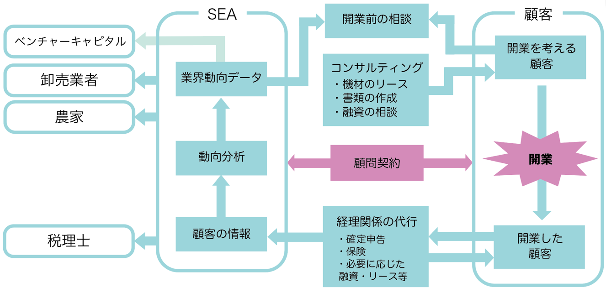

# [個人事業主協会 (Self Employment Association)](https://github.com/yuzuki-chi/Business-Ideas/Self-Employment-Association)

本サービスは、個人事業主の開業と経営にかかる負担を軽減するものである。
本サービスを顧客にわかりやすく伝えることができるよう、「個人事業主協会(Self Employment Association)」と名付け開発を行なった。

個人事業主協会のターゲットは、開業を考える顧客または既に経営を行う個人事業主である。

個人事業主協会ではそれらのターゲットを対象に、開業に向けた業界分析に基づくコンサルティングを行い、開業にかかる手続きの代行または助言を行う。

## サービス概要

1. 開業前の相談・コンサルティング
    1. 必要機材のリース・レンタル
    1. 開業にあたる書類作成
    1. 融資の相談・助言
1. 開業以降の顧問契約 
1. 経理処理の代行
    1. 確定申告や各種税務処理の代行
    1. 保険の仲介
    1. 必要に応じて追加機材のリース・レンタルまたは融資 
1. 定期的な個人事業主向けセミナーの開催
1. 個人事業主コミュニティを提供
1. 同異業種または発注先業種とのマッチング

## ビジネスモデル
